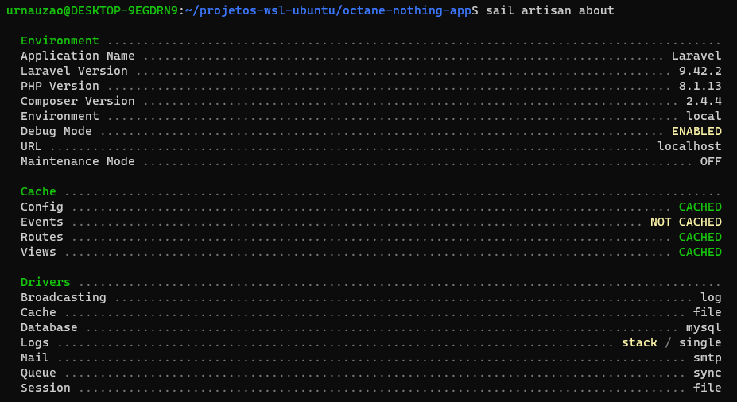

# LARAVEL OCTANE ROADRUNNER
- Cpu: 8 treads
- Memória Ram: 8 gb
- Memória Swap: 8 gb
- WSL2: Ubuntu 20.04.5 LTS
- SO: Windows 10
- Aplicação: 
  - Laravel Sail, 
  - PHP 8.1.13
  - Laravel 9.42.2

---

## Tentativa 1

Server Software: 
Server Hostname:        localhost 
Server Port:            80 
Document Path:          / 
Document Length:        17632 bytes 
Concurrency Level:      10 
Time taken for tests:   63.587 seconds 
Complete requests:      10000 
Failed requests:        0 
Keep-Alive requests:    0 
Total transferred:      186610000 bytes 
HTML transferred:       176320000 bytes 
Requests per second:    <strong>157.27</strong> [#/sec] (mean) 
Time per request:       63.587 [ms] (mean) 
Time per request:       6.359 [ms] (mean, across all concurrent requests) 
Transfer rate:          2865.95 [Kbytes/sec] received 

---

## Tentativa 2

Server Software: 
Server Hostname:        localhost 
Server Port:            80 
Document Path:          / 
Document Length:        17632 bytes 
Concurrency Level:      10 
Time taken for tests:   53.707 seconds 
Complete requests:      10000 
Failed requests:        0 
Keep-Alive requests:    0 
Total transferred:      186610000 bytes 
HTML transferred:       176320000 bytes 
Requests per second:    </strong>186.19</strong> [#/sec] (mean) 
Time per request:       53.707 [ms] (mean) 
Time per request:       5.371 [ms] (mean, across all concurrent requests) 
Transfer rate:          3393.14 [Kbytes/sec] received 

---

## Tentativa 3

Server Software: 
Server Hostname:        localhost 
Server Port:            80 
Document Path:          / 
Document Length:        17632 bytes 
Concurrency Level:      10 
Time taken for tests:   56.194 seconds 
Complete requests:      10000 
Failed requests:        0 
Keep-Alive requests:    0 
Total transferred:      186610000 bytes 
HTML transferred:       176320000 bytes 
Requests per second:    <strong>177.95</strong> [#/sec] (mean) 
Time per request:       56.194 [ms] (mean) 
Time per request:       5.619 [ms] (mean, across all concurrent requests) 
Transfer rate:          3242.99 [Kbytes/sec] received 

