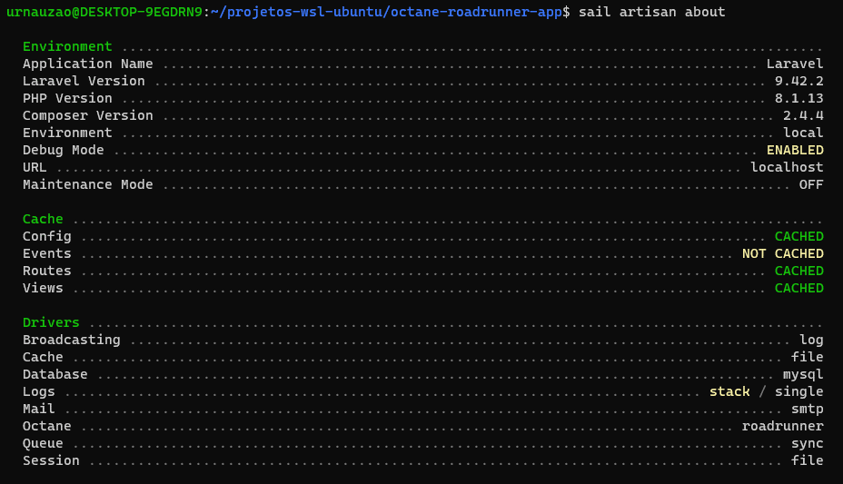

# LARAVEL OCTANE SWOOLE
- Cpu: 8 treads
- Memória Ram: 8 gb
- Memória Swap: 8 gb
- WSL2: Ubuntu 20.04.5 LTS
- SO: Windows 10
- Aplicação: 
  - Laravel Sail, 
  - PHP 8.1.13
  - Laravel 9.42.2

---

## Tentativa 1

Server Software: 
Server Hostname:        localhost 
Server Port:            80 
Document Path:          / 
Document Length:        0 bytes 
Concurrency Level:      10 
Time taken for tests:   3.844 seconds 
Complete requests:      10000 
Failed requests:        0 
Non-2xx responses:      10000 
Keep-Alive requests:    0 
Total transferred:      280000 bytes 
HTML transferred:       0 bytes 
Requests per second:    <strong>2601.55</strong> [#/sec] (mean) 
Time per request:       3.844 [ms] (mean) 
Time per request:       0.384 [ms] (mean, across all concurrent requests) 
Transfer rate:          71.14 [Kbytes/sec] received 

---

## Tentativa 2

Server Software: 
Server Hostname:        localhost 
Server Port:            80 
Document Path:          / 
Document Length:        0 bytes 
Concurrency Level:      10 
Time taken for tests:   3.789 seconds 
Complete requests:      10000 
Failed requests:        0 
Non-2xx responses:      10000 
Keep-Alive requests:    0 
Total transferred:      280000 bytes 
HTML transferred:       0 bytes 
Requests per second:    <strong>2638.94</strong> [#/sec] (mean) 
Time per request:       3.789 [ms] (mean) 
Time per request:       0.379 [ms] (mean, across all concurrent requests) 
Transfer rate:          72.16 [Kbytes/sec] received 

---

## Tentativa 3

Server Software: 
Server Hostname:        localhost 
Server Port:            80 
Document Path:          / 
Document Length:        0 bytes 
Concurrency Level:      10 
Time taken for tests:   3.786 seconds 
Complete requests:      10000 
Failed requests:        0 
Non-2xx responses:      10000 
Keep-Alive requests:    0 
Total transferred:      280000 bytes 
HTML transferred:       0 bytes 
Requests per second:    <strong>2640.99</strong> [#/sec] (mean) 
Time per request:       3.786 [ms] (mean) 
Time per request:       0.379 [ms] (mean, across all concurrent requests) 
Transfer rate:          72.21 [Kbytes/sec] received 

