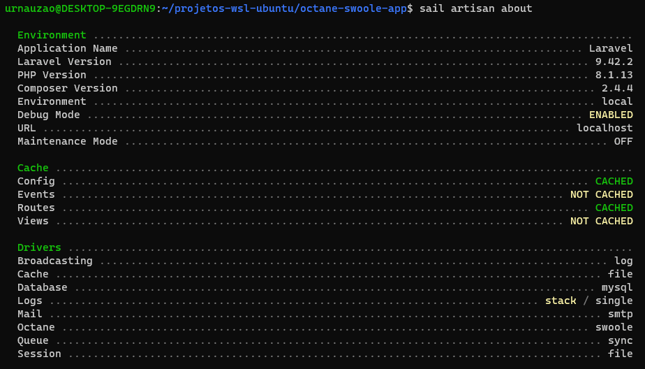

# LARAVEL OCTANE SWOOLE
- Cpu: 8 treads
- Memória Ram: 8 gb
- Memória Swap: 8 gb
- WSL2: Ubuntu 20.04.5 LTS
- SO: Windows 10
- Aplicação: 
  - Laravel Sail, 
  - PHP 8.1.13
  - Laravel 9.42.2

---

## Tentativa 1

Server Software: 
Server Hostname:        localhost 
Server Port:            80 
Document Path:          / 
Document Length:        0 bytes 
Concurrency Level:      10 
Time taken for tests:   24.540 seconds 
Complete requests:      10000 
Failed requests:        0 
Keep-Alive requests:    0 
Total transferred:      0 bytes 
HTML transferred:       0 bytes 
Requests per second:    <strong>407.50</strong> [#/sec] (mean) 
Time per request:       24.540 [ms] (mean) 
Time per request:       2.454 [ms] (mean, across all concurrent requests) 
Transfer rate:          0.00 [Kbytes/sec] received 

---

## Tentativa 2

Server Software: 
Server Hostname:        localhost 
Server Port:            80 
Document Path:          / 
Document Length:        0 bytes 
Concurrency Level:      10 
Time taken for tests:   24.722 seconds 
Complete requests:      10000 
Failed requests:        0 
Keep-Alive requests:    0 
Total transferred:      0 bytes 
HTML transferred:       0 bytes 
Requests per second:    <strong>404.49</strong> [#/sec] (mean) 
Time per request:       24.722 [ms] (mean) 
Time per request:       2.472 [ms] (mean, across all concurrent requests) 
Transfer rate:          0.00 [Kbytes/sec] received 

---

## Tentativa 3

Server Software: 
Server Hostname:        localhost 
Server Port:            80 
Document Path:          / 
Document Length:        0 bytes 
Concurrency Level:      10 
Time taken for tests:   24.736 seconds 
Complete requests:      10000 
Failed requests:        0 
Keep-Alive requests:    0 
Total transferred:      0 bytes 
HTML transferred:       0 bytes 
Requests per second:    <strong>404.26</strong> [#/sec] (mean) 
Time per request:       24.736 [ms] (mean) 
Time per request:       2.474 [ms] (mean, across all concurrent requests) 
Transfer rate:          0.00 [Kbytes/sec] received 

